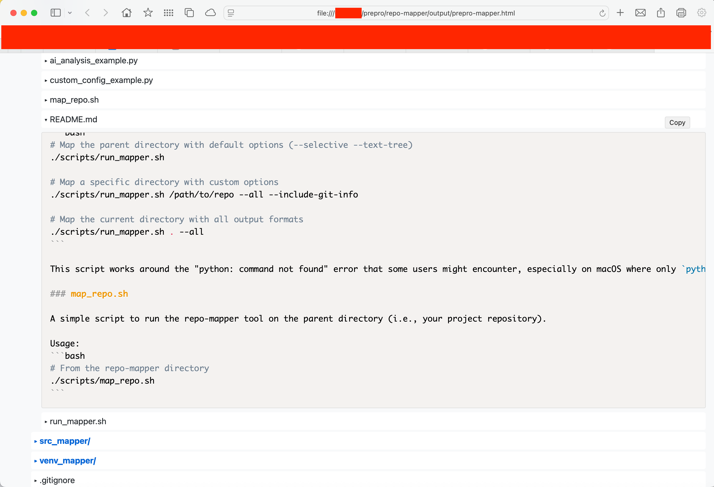
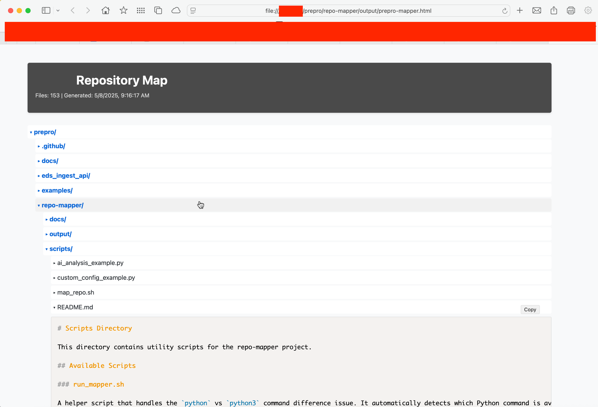
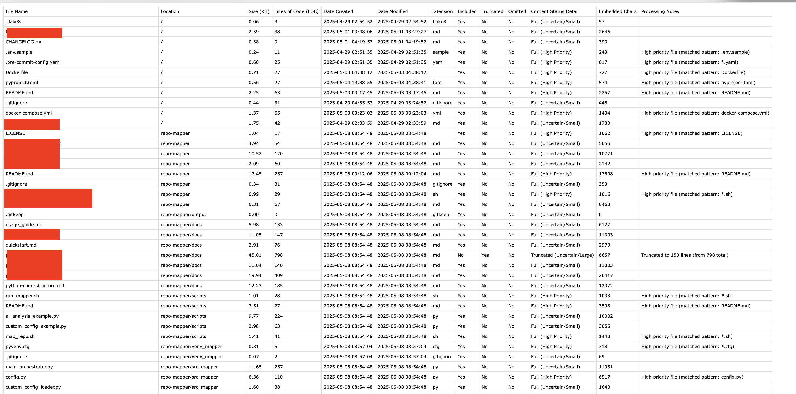

# Repository Mapper (`repo-mapper`)

[](https://www.python.org/downloads/)
[](https://opensource.org/licenses/MIT)

**Transform your code repositories into actionable insights for both human understanding and advanced AI analysis.**

`repo-mapper` is a powerful Python-based toolkit designed to scan local repositories or directories. It generates a suite of structured artifacts, enabling deep dives into project architecture, content prioritization for AI models, and efficient codebase navigation. This tool is your first step towards leveraging Large Language Models (LLMs) to understand and interact with your code.

## The `repo-mapper` Philosophy

Understanding complex codebases is a significant challenge. `repo-mapper` addresses this by:
1.  **Comprehensive Artifact Generation:** Creating multiple views of your repository – from interactive HTML for human browsing to structured data optimized for AI.
2.  **Intelligent Content Prioritization:** A key feature is the "selective map," which intelligently includes, truncates, or omits file content based on configurable heuristics, ensuring AI models receive the most relevant information within their context limits.
3.  **Facilitating LLM Interaction:** While `repo-mapper` itself does not make LLM API calls, it produces outputs specifically designed to be fed into an LLM. This README provides detailed instructions for guiding an LLM to analyze these outputs and generate its own comprehensive understanding report (`repo-rt.md`).

## Features

*   **Multiple Output Artifacts (generated into an `output/` subdirectory):**
    *   **Interactive HTML Map (`{repo_name}-mapper.html`):** For human browsing, with a collapsible tree and embedded file content with syntax highlighting.
    *   **Structure-Only JSON (`{repo_name}-structure.json`):** Lightweight hierarchical representation of files and directories (no content).
    *   **Structure-Only Text Tree (`{repo_name}-structure.txt`):** Human-readable text-based tree view of the repository structure.
    *   **Selective Content JSON Map (`{repo_name}-selective_map.json`):** The primary artifact for AI. Contains full structure, with file content intelligently included (full/truncated) or omitted based on heuristics. Includes metadata per file (`_status`, `_loc`, `_notes`, `_content`).
    *   **Scan Report CSV (`{repo_name}-scan_report.csv`):** A detailed audit trail for the selective mapping process, explaining decisions for each file. Includes file timestamps (created/modified) and (with `--include-git-info` flag) last Git commit details.
*   **Modular Script Architecture (within `src_mapper/`):**
    *   `main_orchestrator.py`: The central script to run, allowing users to select which artifacts to generate.
    *   Dedicated generator modules for each output type.
    *   Customizable configuration with support for user-defined settings in `custom_config.py`. 
    *   Centralized configuration (`config.py`) for easy tuning of heuristics.
*   **Helper Scripts (within `scripts/`):**
    *   `map_repo.sh`: Convenience script for running repo-mapper with all output formats.
    *   `ai_analysis_example.py`: Example script demonstrating AI integration workflow.
    *   `custom_config_example.py`: Template for customizing repo-mapper's behavior.
*   **Intelligent Scanning & Processing:**
    *   Recursive directory scanning.
    *   Respects `.gitignore` rules (basic implementation).
    *   Handles various text encodings and binary files gracefully.
    *   Optional integration with local Git to fetch last commit details per file using the `--include-git-info` flag.
*   **Designed for Portability:** Can be easily dropped into any project repository.
*   **Minimal Dependencies:** Core functionality relies only on standard Python libraries. Git integration (via `--include-git-info`) requires the `git` command-line tool to be installed and accessible in your PATH.

## Requirements

*   Python 3.7+
*   (Optional) `git` command-line tool installed and in PATH if you want to use the `--include-git-info` flag to collect commit information.
*   A modern web browser (for viewing HTML output).
*   Internet connection (for syntax highlighting CDN in HTML output).

## Documentation

* **[Quick Start Guide](docs/quickstart.md)**: A concise guide to get up and running quickly with repo-mapper.
* **[Detailed Usage Guide](docs/usage_guide.md)**: Comprehensive documentation on all features and customization options.
* **Main README (this file)**: Overview of repo-mapper's features and general setup instructions.

## Setup

1.  **Place `repo-mapper` Folder:**
    Copy the entire `repo-mapper` folder (containing `src_mapper/`, `README.md`, etc.) into the root directory of the project repository you wish to analyze.
    ```
    your-project/
    ├── .git/         # Your project's Git directory
    ├── src/          # Your project's source
    ├── ...
    ├── repo-mapper/  <-- Place the folder here
    │   ├── src_mapper/
    │   ├── README.md
    │   └── (output/ will be created here)
    └── .gitignore    # Your project's .gitignore
    ```

2.  **Open Terminal:** Navigate *into* the `repo-mapper` directory within your project.
    ```bash
    cd path/to/your-project/repo-mapper
    ```

3.  **Create and Activate Virtual Environment (Highly Recommended):**
    ```bash
    # Create venv (run once per project where you use repo-mapper)
    python3 -m venv venv_mapper

    # Activate venv (run each time you open a new terminal in this folder)
    # macOS / Linux:
    source venv_mapper/bin/activate
    # Windows (Command Prompt):
    # .\venv_mapper\Scripts\activate.bat
    # Windows (PowerShell):
    # .\venv_mapper\Scripts\Activate.ps1
    ```
    Your terminal prompt should change (e.g., `(venv_mapper)`).

4.  **Install Dependencies (Required for AI Analysis Script):**
    ```bash
    # From the repo-mapper directory with venv active
    python3 -m pip install -r requirements.txt
    ```
    This is only needed if you plan to use the automatic AI analysis script (scripts/ai_analysis_example.py).

## Usage: Generating Repository Artifacts

### Option 1: Using the Helper Script (Recommended)

The easiest way to run repo-mapper is to use the `run_mapper.sh` helper script, which handles Python command differences automatically:

```bash
# From the repo-mapper directory
./scripts/run_mapper.sh [target_path] [options]
```

Examples:
```bash
# Map the parent directory with default options (--selective --text-tree)
./scripts/run_mapper.sh

# Map a specific directory with custom options
./scripts/run_mapper.sh /path/to/repo --all --include-git-info
```

This script automatically detects whether your system has `python` or `python3` available.

### Option 2: Direct Execution

Alternatively, you can run the primary script `main_orchestrator.py` located inside the `src_mapper/` directory directly. Ensure your virtual environment is active and you are in the `repo-mapper` directory.

**Command Structure:**
```bash
python3 src_mapper/main_orchestrator.py <path_to_repo> [options]


<path_to_repo>: (Required) Path to the repository you want to map.

Use .. to map the parent directory (your main project). (Most common usage)

Use . to map the repo-mapper directory itself.

Use any relative or absolute path.

Options (Select which artifacts to generate):

--html: Generate the interactive HTML map.

--json-structure: Generate the structure-only JSON file.

--text-tree: Generate the structure-only text tree file.

--selective: Generate the selective content JSON map AND its companion CSV scan report. (Recommended for LLM analysis)

--all: Generate all available artifact types.

--output-dir <path>: Specify a custom output directory (defaults to repo-mapper/output/).

--include-git-info: Include last Git commit information (hash, author, date, message) in the CSV report. Requires git to be installed.

Examples (Run from inside your-project/repo-mapper/):

Generate all artifacts for the parent project:

python3 src_mapper/main_orchestrator.py .. --all
IGNORE_WHEN_COPYING_START
content_copy
download
Use code with caution.
Bash
IGNORE_WHEN_COPYING_END

Generate only the selective map and CSV report for AI analysis:

python3 src_mapper/main_orchestrator.py .. --selective
IGNORE_WHEN_COPYING_START
content_copy
download
Use code with caution.
Bash
IGNORE_WHEN_COPYING_END

Generate a text tree and HTML map, specifying a custom output directory:

python3 src_mapper/main_orchestrator.py .. --text-tree --html --output-dir ../project_analysis_files
IGNORE_WHEN_COPYING_START
content_copy
download
Use code with caution.
Bash
IGNORE_WHEN_COPYING_END

All generated files will be placed in the output/ subdirectory (or your custom output directory), prefixed with the target repository's name (e.g., your-project-selective_map.json).

## LLM Integration: Generating an AI Analysis Report (`repo-rt.md`)

This section guides you on how to use the generated artifacts to have an LLM (Large Language Model) create a comprehensive analysis report of your repository. This report, `repo-rt.md`, will serve as a valuable reference for both you and the LLM for further interactions.

### Workflow:

1.  **Generate Artifacts:** Run `main_orchestrator.py` with at least the `--selective` flag (or `--all`) to generate the `{repo_name}-selective_map.json` and `{repo_name}-scan_report.csv`. It's also highly recommended to generate `{repo_name}-structure.txt` (`--text-tree`). Ensure your project's main `README.md` file is also captured by the scan (it should be by default unless explicitly excluded in `config.py`).
    ```bash
    # Example: Generate selective map, CSV report, and text tree
    python3 src_mapper/main_orchestrator.py .. --selective --text-tree
IGNORE_WHEN_COPYING_START
content_copy
download
Use code with caution.
Bash
IGNORE_WHEN_COPYING_END

    All outputs will be in the `repo-mapper/output/` directory.

2.  **Option 1: Automated LLM Analysis**
    * The provided script can automate the analysis using various LLM providers:
    * First, install the required dependencies:
      ```bash
      python3 -m pip install -r requirements.txt
      ```
    * Then run the analysis script with your preferred LLM provider:
      ```bash
      python3 scripts/ai_analysis_example.py <repo_name> <absolute_path_to_repo> --provider <provider>
      ```
    
    * **Supported LLM Providers:**
      * `ollama` (default) - Uses local Ollama installation
      * `openai` - Uses OpenAI API (requires API key)
      * `anthropic` - Uses Anthropic Claude API (requires API key)
      * `google` - Uses Google Gemini API (requires API key)

    * **API Keys and Environment Variables:**
      * Copy the `.env.example` file to `.env` and add your API keys:
        ```bash
        cp .env.example .env
        # Edit .env with your preferred text editor to add API keys
        ```
      * Required environment variables for each provider:
        * For OpenAI: Set `OPENAI_API_KEY` environment variable
        * For Anthropic: Set `ANTHROPIC_API_KEY` environment variable
        * For Google: Set `GOOGLE_API_KEY` environment variable
      * Optional model configuration:
        * You can customize models by setting `OLLAMA_MODEL`, `OPENAI_MODEL`, `ANTHROPIC_MODEL`, or `GOOGLE_MODEL` in the `.env` file

    * **Examples:**
      ```bash
      # Using local Ollama (default)
      python3 scripts/ai_analysis_example.py my-project /Users/username/projects/my-project
      
      # Using OpenAI with GPT-4
      python3 scripts/ai_analysis_example.py my-project /Users/username/projects/my-project --provider openai
      
      # Using Claude with a specific model
      python3 scripts/ai_analysis_example.py my-project /Users/username/projects/my-project --provider anthropic --model claude-3-sonnet-20240229
      ```
      
    * The script automatically loads all output files, formats the prompt, sends it to the specified LLM provider, and saves the analysis as `repo-rt.md`.
    
    * **Default Models:**
      * Ollama: `qwen3:32b`
      * OpenAI: `gpt-4-turbo`
      * Anthropic: `claude-3-opus-20240229` 
      * Google: `gemini-pro`
      
    * **Note about quality:** Advanced commercial LLMs like OpenAI's GPT-4 and Anthropic's Claude generally produce more accurate analyses with fewer hallucinations compared to local models.
    
    * **Troubleshooting:** If you encounter "ModuleNotFoundError: No module named 'requests'", ensure you're running the command in the activated virtual environment and that you've installed the dependencies with the same Python used to run the script.

3.  **Option 2: Manual LLM Analysis (Any LLM)**
    *   Locate the generated files in the `repo-mapper/output/` directory.
    *   Open the following files and be ready to copy their full content:
        *   Your project's main `README.md` content (if its full content was included in the selective map, you can note that when instructing the LLM).
        *   `{repo_name}-structure.txt`
        *   `{repo_name}-scan_report.csv`
        *   `{repo_name}-selective_map.json`
    *   Note the **absolute path** to your project's root directory (e.g., `/Users/yourname/projects/your-project`).
    *   Open your preferred LLM chat interface (e.g., within your IDE).
    *   Copy the **entire content** of the "LLM Repository Analysis Instructions" block provided in the `LLM_Analysis_Prompt_Template.md` file at the root of the repo-mapper directory.
    *   Paste the instruction block into the chat.
    *   **Crucially, replace the placeholders** within the instruction block with:
        *   The absolute path to your repository.
        *   The actual content of Artifacts 1, 2, 3, and 4.
    *   Send the prompt to the LLM.

4.  **Review and Save `repo-rt.md`:**
    *   The LLM will generate the Markdown content for the `repo-rt.md` report.
    *   Review the generated report for accuracy and completeness.
    *   Save this content as `repo-rt.md` in your main `repo-mapper/` directory (not the `output/` subdirectory). This file now becomes your primary, AI-generated reference for the repository.

5.  **Further Interaction & On-Demand File Reading:**
    *   You can now ask the LLM more specific questions about the codebase, referencing its own `repo-rt.md` report or the initial artifacts.
    *   If the LLM (or you) identify a need to see the full content of a file listed in the "Areas for Deeper Review" section of `repo-rt.md` (or any other truncated/omitted file), you can then introduce the **File-Reading Tool**. Instructions and the code snippet for this tool are provided in the "AI Tool Integration: On-Demand File Content Retrieval" section below.

The full prompt template is also available as a separate file called `LLM_Analysis_Prompt_Template.md` in the root of the repo-mapper directory for easy copying and editing.

### AI Tool Integration: On-Demand File Content Retrieval

When interacting with the LLM after the initial `repo-rt.md` has been generated, you may need to provide the full content of files that were truncated or omitted in the selective map. Below is a Python code snippet that you can provide to the LLM as a retrieval tool.

**Python Tool Code Snippet:**

```python
import os
import json
from pathlib import Path

def read_file_from_repo(repo_path, relative_file_path):
    """
    Tool for the LLM to read the full content of any file in the repository.
    
    Args:
        repo_path (str): The absolute path to the repository's root directory.
        relative_file_path (str): The relative path to the file from the repository root.
        
    Returns:
        str: The full content of the requested file, or an error message if not found.
    """
    try:
        # Normalize paths and construct absolute file path
        repo_path = os.path.abspath(os.path.expanduser(repo_path))
        if relative_file_path.startswith('/'):
            relative_file_path = relative_file_path[1:]  # Remove leading slash if present
            
        full_path = os.path.join(repo_path, relative_file_path)
        
        # Security check - ensure the file is within the repository
        repo_path_obj = Path(repo_path)
        file_path_obj = Path(full_path)
        if not str(file_path_obj.absolute()).startswith(str(repo_path_obj.absolute())):
            return f"ERROR: Security violation. The requested file path '{relative_file_path}' " \
                   f"attempts to access files outside the repository."
        
        # Check if the file exists
        if not os.path.exists(full_path):
            return f"ERROR: File not found at path '{relative_file_path}' " \
                   f"within the repository at '{repo_path}'."
        
        # Check if it's a directory
        if os.path.isdir(full_path):
            return f"ERROR: The path '{relative_file_path}' is a directory, not a file."
            
        # Check file size
        file_size_mb = os.path.getsize(full_path) / (1024 * 1024)
        if file_size_mb > 10:  # 10MB limit
            return f"ERROR: File size ({file_size_mb:.2f} MB) exceeds the 10MB limit. " \
                   f"Please request a different file or implement pagination."
        
        # Read and return file content
        try:
            with open(full_path, 'r', encoding='utf-8') as file:
                content = file.read()
                return content
        except UnicodeDecodeError:
            # Try to determine if it's a binary file
            import mimetypes
            mime_type, _ = mimetypes.guess_type(full_path)
            if mime_type and not mime_type.startswith('text/'):
                return f"ERROR: The file at '{relative_file_path}' appears to be a binary file " \
                       f"(detected MIME type: {mime_type}). This tool only supports text files."
            
            # If MIME type check doesn't help, try a different encoding
            with open(full_path, 'r', encoding='latin-1') as file:
                content = file.read()
                return f"NOTE: The file was read with latin-1 encoding due to UTF-8 decode errors.\n\n{content}"
    
    except Exception as e:
        return f"ERROR: An unexpected error occurred while reading the file: {str(e)}"


# Example usage:
# To use this tool, the LLM needs to call the function with the correct repository path
# and the relative path to the file it wants to read.
#
# Replace these values with the actual repository path and the file path you want to read:
repo_path = "/path/to/your/repository"  # Absolute path to the repository root
relative_file_path = "src/main.py"      # Path relative to the repository root
#
# result = read_file_from_repo(repo_path, relative_file_path)
# print(result)
```

**Security Considerations for Tool Usage:**

* The tool includes security checks to prevent accessing files outside the repository's directory.
* It has a file size limit of 10MB to prevent memory issues.
* It handles different text encodings gracefully.
* Binary files are detected and rejected with appropriate warning messages.
* Error handling provides clear feedback on any issues encountered.

When sharing this tool with the LLM, include the actual repository path where the code is stored, and instruct the LLM to use this function whenever it needs to read a file's full content.

## Configuration (Selective Mapper)

The heuristics used by the selective content generator (which files/folders/extensions to prioritize or exclude, size thresholds, truncation lengths, content budget) are defined as constants within `src_mapper/config.py`.

Users are encouraged to inspect and modify these configurations to better suit the specific characteristics of their repositories and analysis needs before running the mapper with the `--selective` flag.

## Limitations

* **HTML File Size:** The interactive HTML map can be very large for big repositories, potentially causing performance issues in browsers.
* **Binary Files:** Binary files are detected and excluded from content embedding but detected using simple heuristics.
* **.gitignore Parsing:** The basic implementation of .gitignore parsing may not handle all complex patterns.
* **Encoding Issues:** While the tool handles various text encodings, it may not perfectly handle all edge cases.
* **Heuristic Dependency:** The "selective" mapping relies on heuristics that may not perfectly identify the most important files in all codebases.
* **Syntax Highlighting:** The HTML output uses Prism.js via CDN, requiring an internet connection for syntax highlighting to work.

## License

This project is licensed under the MIT License.

## Screenshots





